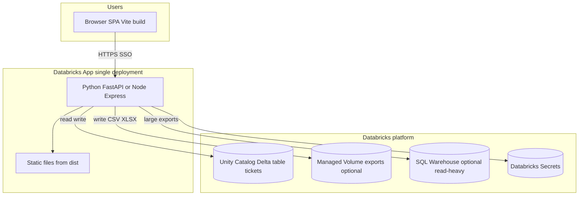

# Target architecture — Databricks Apps (ticket control + stakeholder export)

> **Scope:** Single reference design for hosting this product on **Databricks Apps**, replacing personal SharePoint/Drive dependencies. **English** technical doc (project standard). Validate **DBU rates and contract** against your Databricks order form; numbers below use **public list examples** only.

---

## 1. Goals (from product)

| Goal | Requirement |
|------|-------------|
| **Ticket control** | CRUD + filters + bulk actions; multi-user; no long-lived secrets in the browser. |
| **Easy export for stakeholders** | CSV/XLSX download and/or governed file drop (Unity Catalog **Volume**); auditable path. |
| **Cost control** | App **Stopped** outside business hours → **no app compute charge** (per [Databricks Apps key concepts](https://docs.databricks.com/aws/en/dev-tools/databricks-apps/key-concepts)). |

---

## 2. Option comparison

| Dimension | **A — Static SPA only** | **B — SPA + BFF (recommended)** |
|-----------|-------------------------|----------------------------------|
| **Runtime** | Node serves `dist/` only | One process (e.g. **FastAPI**) serves `dist/` + `/api/*` |
| **Persistence** | Still client-only unless you add another hosted API | **Delta / SQL** on Databricks; secrets server-side |
| **Auth** | Limited; hard to hide tokens | OAuth / session; identity from workspace |
| **Export** | Browser-only generation (weak governance) | Server-generated files; UC paths; optional SQL Warehouse for heavy queries |
| **Replaces Francisco’s Drive** | No | **Yes** (data + export live in UC) |
| **Operational fit** | Fastest MVP | **Default target** for this repo’s backend handoff |

**Recommendation:** **Option B** — aligns with [`docs/BACKEND_EXCEL_HANDOFF.md`](./BACKEND_EXCEL_HANDOFF.md) Phase B (minimal API) and retires `localStorage` as system of record.

---

## 3. Recommended target architecture (Option B)

### 3.1 Logical view



- **Single URL** for users: the App URL. The SPA calls **same-origin** `/api/v1/...` (no CORS pain).
- **BFF** holds **service** credentials (if any) in **Secrets**, never in `localStorage`.
- **Canonical data:** `catalog.schema.tickets` (Delta), schema mapped from [`src/types.ts`](../src/types.ts) `Ticket` (with explicit versioning column `schema_version` or `ingested_at`).

### 3.2 Repository layout (suggested)

```
app/                          # Databricks App root (Git subfolder or monorepo path)
  app.yaml                    # command, env, optional warehouse binding
  requirements.txt            # fastapi uvicorn gunicorn databricks-sdk ...
  src/
    main.py                   # mounts StaticFiles("/") + APIRouter("/api/v1")
    api/
      tickets.py              # GET/POST/PATCH + export
    static/                   # populated by CI: npm run build → copy dist/*
  package.json                # ONLY if you keep a separate Node build step in CI
```

**Engineering standard (PEP 8, SOLID, DDD, TDD, pluggable layers):** evolve the
Python tree toward **hexagonal + repository + use-case handlers** so new
endpoints stay easy to add and the SPA keeps a stable **OpenAPI** contract.
See **[`docs/BACKEND_ENGINEERING_CONTEXT.md`](./BACKEND_ENGINEERING_CONTEXT.md)**.

**Alternative:** keep building the SPA in the existing repo root and **CI copies** `dist/` into `app/static/` before `databricks apps deploy`. The important part is: **Databricks deploy bundle includes a runnable web server + `dist`**.

### 3.3 `app.yaml` (illustrative — adjust to official schema)

```yaml
# Illustrative only — validate against:
# https://docs.databricks.com/aws/en/dev-tools/databricks-apps/app-runtime
command: ["gunicorn", "src.main:app", "-b", "0.0.0.0:${DATABRICKS_APP_PORT}", "--workers", "2"]
env:
  - name: TICKETS_TABLE
    value: "catalog.schema.tickets"
  # Bind SQL warehouse for heavy exports (optional):
  # - name: DATABRICKS_SQL_WAREHOUSE_ID
  #   valueFrom: sql_warehouse:main
```

### 3.4 API surface (minimal, matches handoff)

| Method | Path | Notes |
|--------|------|--------|
| `GET` | `/api/v1/tickets` | List; add pagination before large N |
| `POST` | `/api/v1/tickets` | Create |
| `PATCH` | `/api/v1/tickets/{id}` | Partial update |
| `DELETE` | `/api/v1/tickets/{id}` | Optional |
| `POST` | `/api/v1/tickets/bulk` | Optional status updates |
| `GET` | `/api/v1/export.csv` | Stakeholder export |

### 3.5 Export for stakeholders

| Pattern | When to use |
|---------|-------------|
| **Streaming CSV download** | Small/medium extracts; simplest UX. |
| **Generate file on Volume + signed path / job output** | Large extracts; retention policy; audit. |
| **Databricks SQL / Dashboard** | Stakeholders already licensed; less custom UI. |

---

## 4. Scheduling: business hours only

Databricks Apps **do not** ship a built-in “office hours” scheduler ([community guidance](https://community.databricks.com/t5/data-engineering/databricks-apps-auto-terminate-option/td-p/143171)).

**Pattern:** two **Databricks Jobs** (or one with two tasks on different schedules):

| Job | Trigger | Action |
|-----|---------|--------|
| `app_start_morning` | Cron e.g. `0 7 * * MON-FRI` TZ America/Sao_Paulo | `databricks apps start <name>` or SDK `w.apps.start(name=...)` |
| `app_stop_evening` | Cron e.g. `0 20 * * MON-FRI` | `databricks apps stop <name>` or `w.apps.stop(name=...)` |

Use a **service principal** with least privilege to start/stop **only** that app. Document run-as user in runbook.

---

## 5. Cost model — DBU per day (app compute only)

### 5.1 Published consumption rates (check your contract)

Databricks’ public pricing page states ([Databricks Apps pricing](https://www.databricks.com/product/pricing/databricks-apps)):

- **Medium** app: **0.5 DBU per hour** while **Running**
- **Large** app: **1.0 DBU per hour** while **Running**

**Stopped** apps: per [Key concepts](https://docs.databricks.com/aws/en/dev-tools/databricks-apps/key-concepts), **no compute charge** while stopped (configuration retained).

The **$/DBU** rate depends on **cloud, region, and commercial agreement**. The same pricing page shows an **example** list rate of **$0.75 / DBU** (Premium, AWS, as displayed on the page — **not** a commitment quote).

### 5.2 Formula

```
DBU_app_per_day = (hours_running_that_day) × (DBU_per_hour_for_size)
USD_app_per_day ≈ DBU_app_per_day × ($/DBU from your contract)
```

**Not included** in the formula (bill separately if used):

- **SQL Warehouse** DBUs during exports/dashboards  
- **Storage** (Delta, ADLS backing UC, Volume files)  
- **Network egress** (large downloads outside region)

### 5.3 Scenarios (illustrative USD using **$0.75 / DBU** example only)

Assume **one** app, **5 business days / week**, same schedule every weekday.

| App size | Hours Running / day | DBU/h (published) | DBU/day | USD/day (@ $0.75) | USD/month (~22 bd) |
|----------|---------------------|-------------------|---------|-------------------|---------------------|
| Medium | 8 | 0.5 | **4.0** | **~$3.00** | **~$66** |
| Medium | 10 | 0.5 | **5.0** | **~$3.75** | **~$82** |
| Medium | 24 | 0.5 | **12.0** | **~$9.00** | **~$198** |
| Large | 8 | 1.0 | **8.0** | **~$6.00** | **~$132** |
| Large | 10 | 1.0 | **10.0** | **~$7.50** | **~$165** |

**Weekend fully Stopped:** add **$0** app compute for Sat–Sun if jobs stop the app Friday night and restart Monday morning.

### 5.4 How to pick Medium vs Large (rule of thumb)

| Start with | When |
|--------------|------|
| **Medium** | SPA + thin BFF, few concurrent users, exports &lt; ~100k rows with pagination/streaming. |
| **Large** | Heavy concurrent users, large in-memory transforms, or you observe CPU/memory pressure in app logs. |

Right-size after **1–2 weeks of metrics** (Databricks app monitoring / logs).

---

## 6. Migration path from current repo

1. Implement **`TicketsRepository`** HTTP adapter in the SPA (per [`BACKEND_EXCEL_HANDOFF.md`](./BACKEND_EXCEL_HANDOFF.md) §3.3).  
2. Ship **BFF + Delta** in `app/` (this doc).  
3. **Dual-write or cutover** weekend: export from `localStorage` once, import into Delta, flip feature flag to HTTP-only.  
4. Retire simulated Graph credentials in [`SheetDatabase.tsx`](../src/components/SheetDatabase.tsx).

---

## 7. References

- [Deploy a Databricks app](https://docs.databricks.com/aws/en/dev-tools/databricks-apps/deploy)  
- [Configure Databricks app execution with `app.yaml`](https://docs.databricks.com/aws/en/dev-tools/databricks-apps/app-runtime)  
- [Key concepts (Running / Stopped / billing)](https://docs.databricks.com/aws/en/dev-tools/databricks-apps/key-concepts)  
- [Databricks Apps pricing](https://www.databricks.com/product/pricing/databricks-apps)  
- [Apps API — stop](https://docs.databricks.com/api/workspace/apps/stop) (for automation)  
- Backend handoff: [`docs/BACKEND_EXCEL_HANDOFF.md`](./BACKEND_EXCEL_HANDOFF.md)  
- Back-end code standards: [`docs/BACKEND_ENGINEERING_CONTEXT.md`](./BACKEND_ENGINEERING_CONTEXT.md)

---

## 8. Open items for your ABI workspace admin

- Confirm **Premium** (or equivalent) and **Apps** enabled.  
- Confirm **allowed** egress domains if Private Link.  
- Confirm **$/DBU** for the Apps SKU on your contract (replace `$0.75` in section 5.3).  
- Approve **service principal** for scheduled start/stop Jobs.
